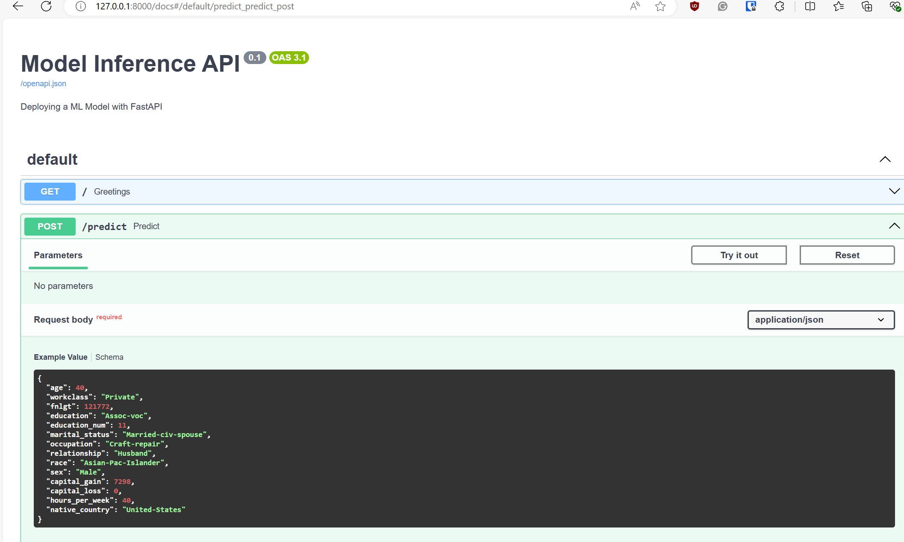
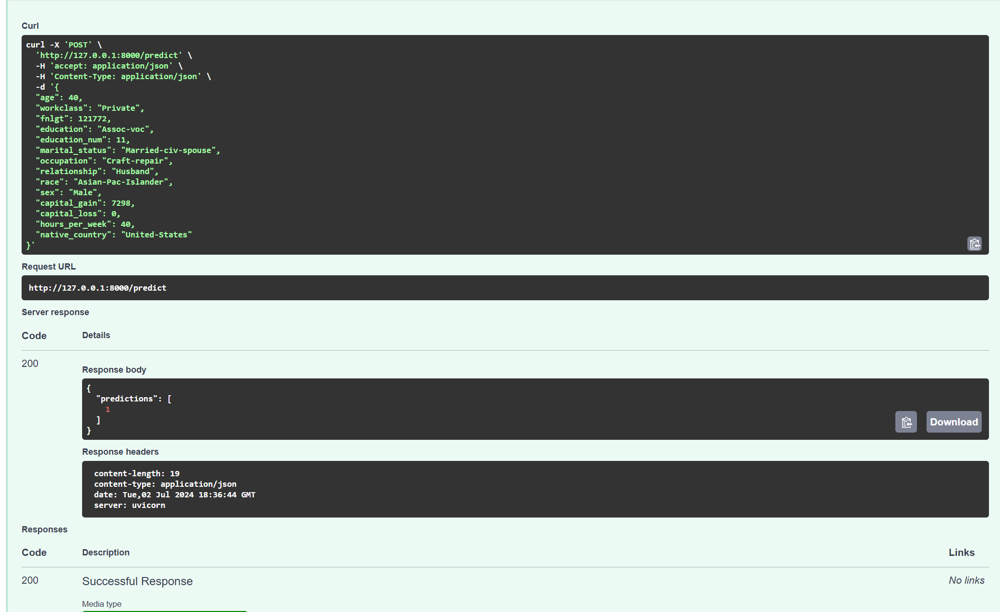
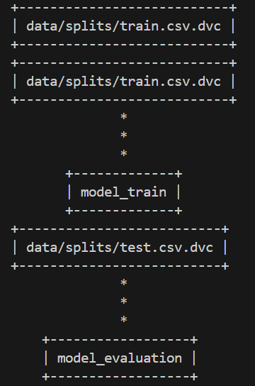
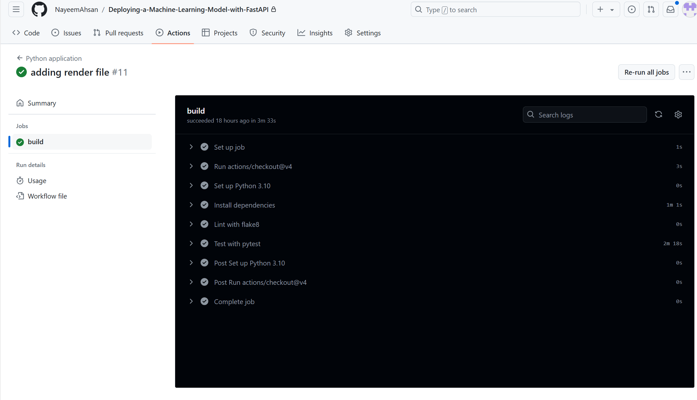
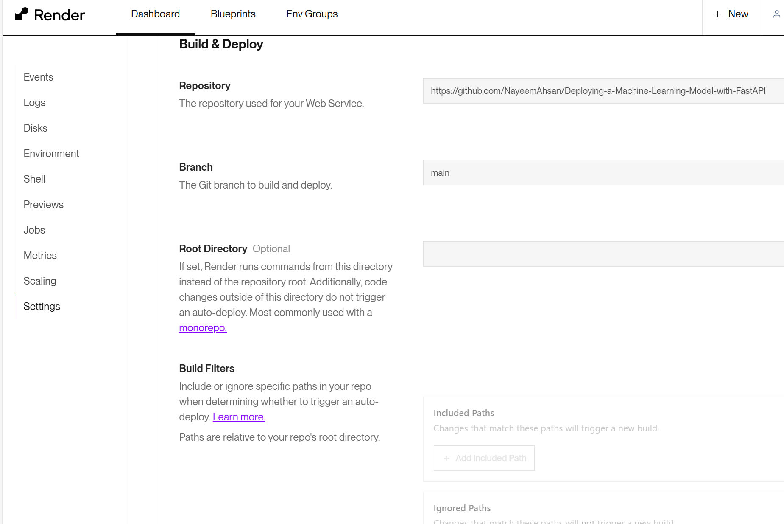
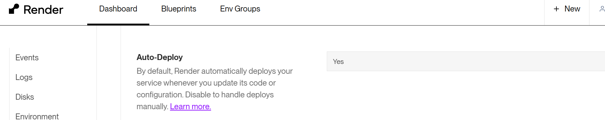
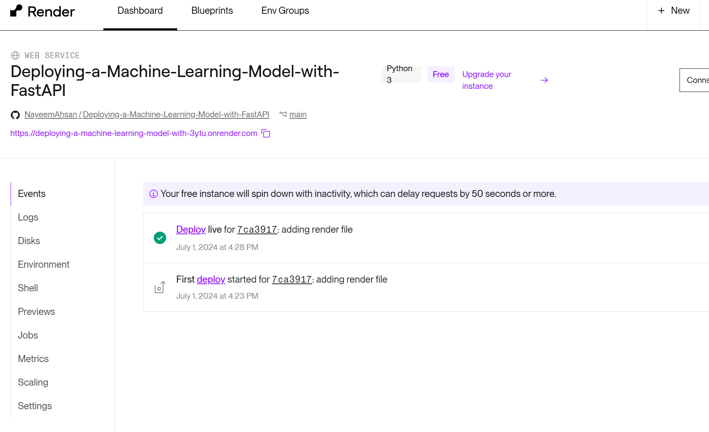
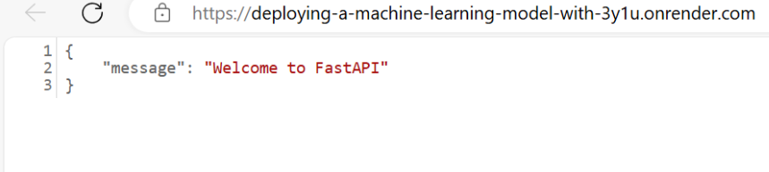
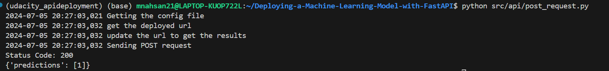

# Deploying-a-Machine-Learning-Model--with-FastAPI
This project developes a classification model on publicly available Census Bureau data, and deploys it using the FastAPI package on Render cloud platform. 

## Description
This project is part of Udacity MLOps Nanodegree program. The problem is to build a classification model that predicts an employer's annual income more than $50K using the census income [dataset](https://archive.ics.uci.edu/ml/datasets/census+income) from UCI. The application is deployed using FastAPI, with CI/CD using Github Actions and Render respectively.

## Prerequisites
- Python v3.10
- DVC for artifact versioning
- Github account to use Github Actions for CI
- Render account for CD
- Linux environment 

## Dependencies
This project dependencies is available in the ```requirements.txt``` file.

## Installation
Use the package manager [pip](https://pip.pypa.io/en/stable/) to install the dependencies from the ```requirements.txt```. Its recommended to install it in a separate virtual environment.

```bash
pip install -r requirements.txt
```

## Project Structure
```bash
📦Deploying-a-ML-Model-on-Heroku-with-FastAPI
 ┣ 
 ┣ 📂.github
 ┃ ┗ 📂workflows
 ┃ ┃ ┗ 📜ci-cd.yml          # Github Action yml file
 ┣ 📂data                   # Dataset folder
 ┣ 📂EDA                    # EDA notebook for preprocessing
 ┣ 📂images                 # Saved images including screenshots
 ┣ 📂models                 # Trained models
 ┣ 📂output_metrics         # Model metrics
 ┣ 📂src                
 ┃ ┣ 📂api                  # FastAPI folder
 ┃ ┣ 📂pipeline             # Model pipeline architecture and train functions
 ┃ ┣ 📂tests                # Testing functions
 ┣ 📜model_card.md          # Model card includes info about the model 
 ┣ 📜README.md 
 ┣ 📜config.yaml            # config file             
 ┗ 📜dvc.yaml               # Pipeline thorugh dvc
 ┗ 📜requirements.txt       # Projects required dependencies
 ┗ 📜render.yaml            # Deployment file for Render
```
## Usage
The config file contains data variables like, data path, train and test size, random seed, etc. It also contains model variables like paramerters values for Random Forest Classifier used in this example. It also has feature information and example of sample data. This file can be used for any other models or features. There is no need to change any code inside any python files. Only changing variables from the config file will work.  

### Steps

#### Pipeline building

##### EDA
```bash
cd EDA
jupyter labs
```
##### Load and Preprocess data
```bash
python src/pipeline/load_and_preprocess_data.py --config config.yaml
```
##### Train and Test Split
```bash
python src/pipeline/train_test_split.py --config config.yaml
```
##### Train Model
```bash
python src/pipeline/model.py --config config.yaml
```
##### Evaluation
```bash
python src/pipeline/evaluate.py --config config.yaml
```
##### Data Slice Evaluation
```bash
python src/pipeline/data_slicing.py --config config.yaml
```

#### API app
##### Start the app using FastAPI
```bash
uvicorn src.api.main:app --reload
```
##### FastAPI app documentation to test the API from the browser
```
http://127.0.0.1:8000/docs
```



#### Testing

##### Testing the project
```bash
pytest src/test -vv --config config.yaml
```

#### DVC 

##### The pipeline can be run automatically with DVC command
```bash
dvc repro
```
This will read the dvc.yaml file and run the commands accordingly. 

##### Showing tracked files with DVC
```bash
dvc dag
```


#### CI/CD

##### CI using github action will be triggered upon pushing to github
```bash
git push
```
Image showing successful intergration 


##### CD is enabled from within Render app settings



Succesfull deployment 


##### Starting the app on Render



##### Test deployment on Render, demo post request
```bash
python src/api/post_request.py
```


## Github Link
https://github.com/NayeemAhsan/Deploying-a-Machine-Learning-Model-with-FastAPI

## License
Distributed under the [MIT](https://choosealicense.com/licenses/mit/) License. See ```LICENSE``` for more information.

